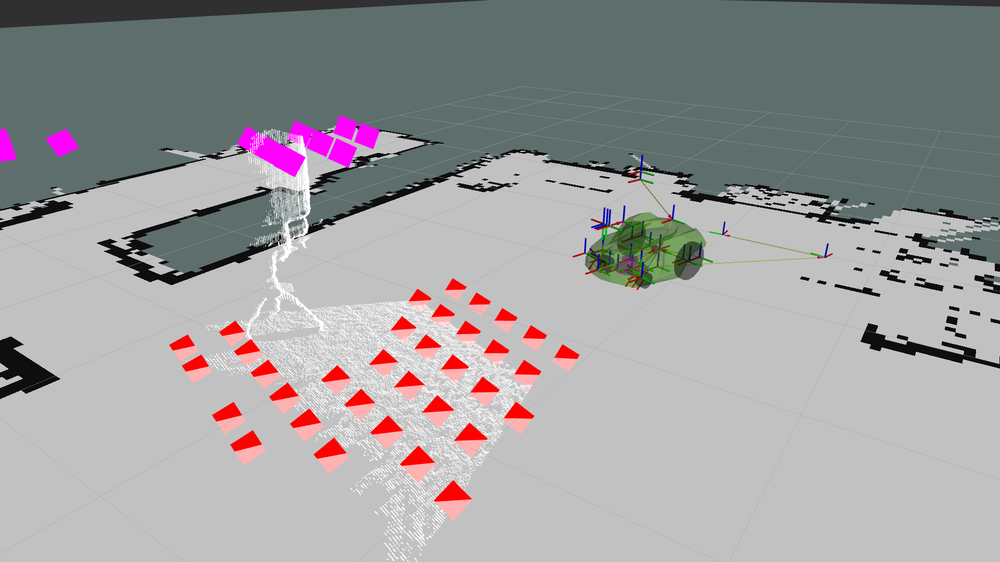

# Point cloud subsampler

Subsample a point cloud to lower density. Intended usage is as input to
a costmap or other obstacle avoidance system.

This nodelet splits the point cloud into grid cells and puts one z level into
each cell that contains an obstacle and another into each cell that contains no
obstacles.

This node will also remap into the target TF frame (**before** processing). This
is useful if your point cloud TF frame is in a weird orientation.

Note! This depends on [ros_spatial_utils](https://github.com/VorpalBlade/ros_spatial_utils).

## Topic

* `points` (`sensor_msgs/PointCloud2`) - Input high density cloud.
* `subsampled_points` (`sensor_msgs/PointCloud2`) - Output low density cloud.

The node only does processing if it has subscribers.

## Parameters

Dynamic reconfigure is supported.

* `min_z` (`double`, default: 0.0) - Minimum z for obstacles (m)
* `min_z_slope` (`double`, default: 0.0) - Slope coefficient for increasing
  `min_z` as a function of distance from the sensor
* `max_z` (`double`, default: 2.0) - Maximum z for obstacles (m)
* `free_z` (`double`, default: 0.0) - Published z for free space (m)
* `obstacle_z` (`double`, default: 1.0) - Published z for obstacles (m)
* `resolution` (`double`, default: 0.0) - Distance between output points (m)
* `max_dist` (`double`, default: 4.0) - Maximum Euclidean distance from sensor in the plane (m)
* `tf_timeout` (`double`, default: 0.1) - Timeout for waiting for TF transform (s)
* `target_frame` (`string`, default: "base_footprint") - Target TF frame

The slope coefficient might need some further explanation: Basically the range
is multiplied with this value and added to min_z. This allows increasing the
minimum height of obstacles the further away from the sensor to deal with errors
that are range-dependent (such as noise from a stereo camera, as well as
imprecise tilt alignment).
